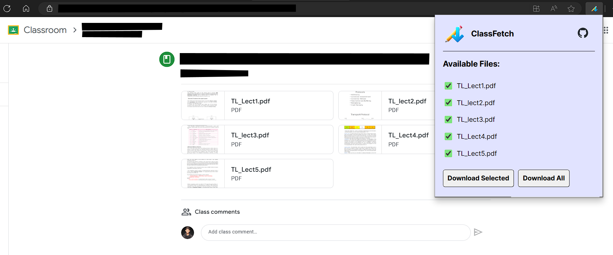

# ClassFetch

A browser extension that allows you to bulk download files from Google Classroom in a single click! Save those frustrating 🖱️ clicks!

## Features

- Download all the drive files in a Google Classroom announcement
- Select multiple files to be downloaded at once

## Installation

1. Download or clone this repository.
2. Open the Extension Management page by navigating to `chrome://extensions`
   - Alternatively, open this page by clicking on the Extensions menu button and selecting Manage Extensions at the bottom of the menu
   - Alternatively, open this page by clicking on the Chrome menu, hovering over More Tools then selecting Extensions
3. Enable Developer Mode by clicking the toggle switch next to Developer mode
4. Click the Load unpacked button and select the extension directory
   Note: Remember to select the root folder, and reload the classroom website if it is open in the background
5. Pin the extension for easier access

## Usage

1. Open the Google Classroom announcement where your teacher has attached multiple files
2. While this page is open, click on the 'ClassFetch' exntension. Your files should now be listed along with a checkbox on the left
3. Select the files that you want to download and click the 'Download Selected' button. (This might take a while depending on the size of the files)
4. Alternatively, select the 'Download All' button to download all the files that are currently being listed

> Note: If your files are not showing up, try refreshing the Google Classroom website

## Contributing

Pull requests are welcome, there's so much that could be added to make this extension better for everyone! For major changes, please open an issue first to discuss what you would like to change.

## License

[MIT](https://choosealicense.com/licenses/mit/)
